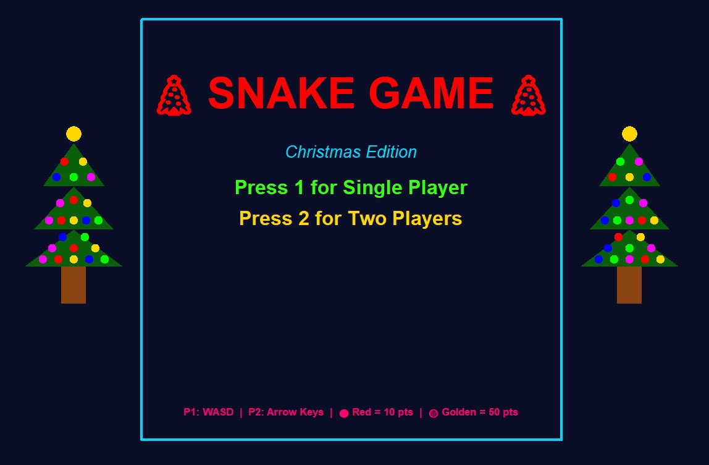
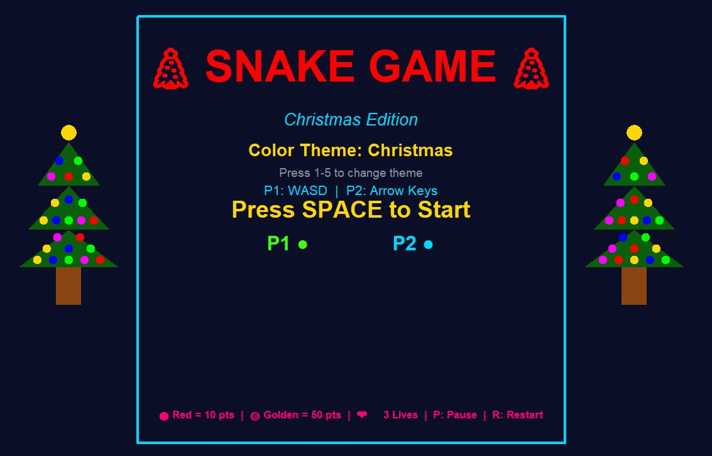
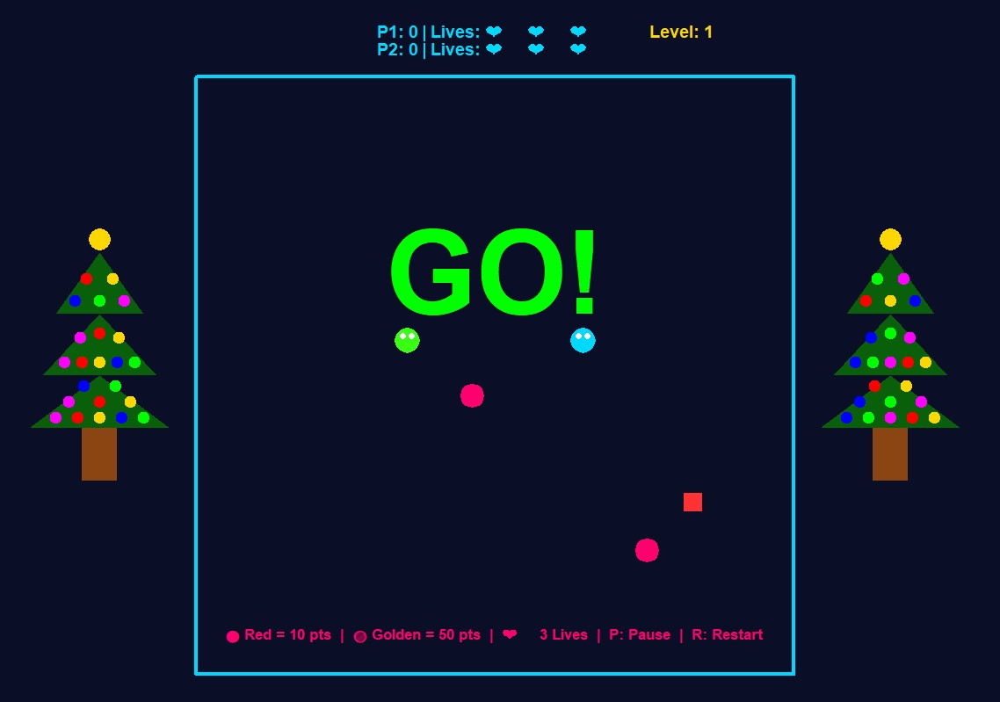

# 🐍 Snake Game - Christmas Edition

Classic Snake game built with Python and Pygame featuring single-player and two-player modes with a festive Christmas theme!

## ✨ Features

- 🎮 **Single Player & Two Player modes**
- 🎄 **Christmas-themed graphics** with animated decorations
- 🎨 **5 different color themes** (Christmas, Classic, Neon, Ocean, Sunset)
- 🏆 **Scoring system** - Red food (10 pts), Golden food (50 pts)
- ❤️ **Lives system** - 3 lives per player
- ⏸️ **Pause and restart** functionality
- 🎯 **Progressive difficulty** with level system

## 📸 Screenshots

### Main Menu


### Two Player Mode


### Gameplay


## 🎮 Controls

### Player 1
- **W** - Move Up
- **A** - Move Left
- **S** - Move Down
- **D** - Move Right

### Player 2 (Two Player Mode)
- **Arrow Keys** - Move in respective directions

### General Controls
- **1** - Start Single Player
- **2** - Start Two Player
- **1-5** - Change color theme (in theme selection)
- **P** - Pause game
- **R** - Restart game
- **SPACE** - Start game (after selecting mode)

## 🚀 Installation & Running

1. Make sure you have Python installed
2. Install Pygame:
```bash
pip install pygame
```
3. Run the game:
```bash
python snake.py
```

## 🛠️ Requirements

- Python 3.x
- Pygame library

## 🎯 How to Play

1. Select single player (1) or two player (2) mode
2. Choose your color theme (1-5)
3. Press SPACE to start
4. Eat the food to grow and score points
5. Avoid hitting walls and yourself
6. Golden food gives 50 points, red food gives 10 points
7. You have 3 lives - don't waste them!

## 👨‍💻 Author

**Mario-Alexandru Nicolae**  
3rd Year Computer Science Student - TU Delft

---

*Enjoy the game and Happy Holidays! 🎄*
